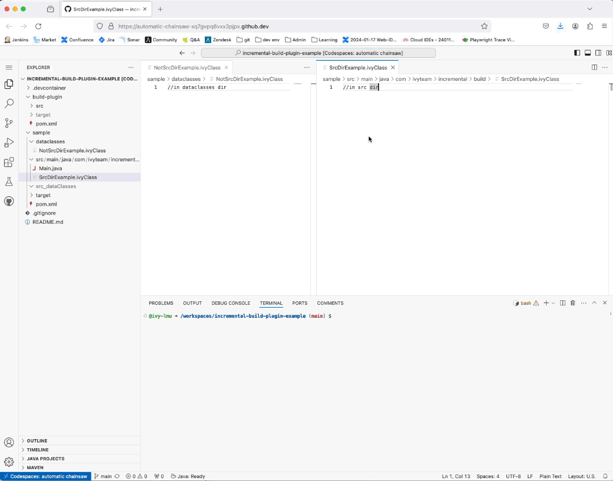

This repo is used to reproduce an incremental m2e build problem in VS Code using the Extension Pack for Java.
Reported with https://github.com/redhat-developer/vscode-java/issues/3632

# Goal
With the help of our maven plugin (see `/build-plugin`) we want to incrementally convert `*.ivyClass` files into `*.java` files. The resulting java files will be written into `src_dataClasses` folder. So if an `*.ivyClass` file is created or changed, the plugin is expected to write/update the corresponding `*.java` file.

# Setup
## build-plugin
`/build-plugin` is the maven plugin.

- `src/../BuildDataClassMojo.java` MOJO that is used to transform `*.ivyClass` files to `*.java` files.
- `src/../lifecycle-mapping-metadata.xml` specifies that the `build-data-class` goal is executed incrementally.
- `src/../components.xml` defines the custom `iar` maven packaing type, that is used in `/sample/pom.xml`.

## sample
`/sample` project where the maven plugin is used.

- `src/../SrcDirExample.ivyClass` file that should be transformed by the MOJO located in the src folder.
- `dataclasses/NotSrcDirExample.ivyClass` file that should be transformed by the MOJO located in a folder that is not a src folder.

# Problem
With VS Code and Extension Pack for Java the incremntal build does not work properly. Note that I do not observe the following problem in the Eclipse IDE.

src folders and non src folders seem to be watched differently. If an `*.ivyClass` is edited in an src folder, the corresponding `*.java` is created immediately. Nothing is created for `*.ivyClass` files that are not in the src folder. Sometimes the creation is triggered when I click through the Java Projct view.

Example recording:

# Reproduce
You can run this project using codespaces.

- install the build-plugin (not needed if devcontainer/codespaces is used) `mvn -f build-plugin install`
- wait until "Java: Ready" status message appears in VS Code
- press "Realod All Maven Projects" button under maven view
- edit `src/../SrcDirExample.ivyClass`, verify that `src_dataClasses/SrcDirExample.java`gets immediately created
- edit `dataclasses/NotSrcDirExample.ivyClass`, nothing gets created